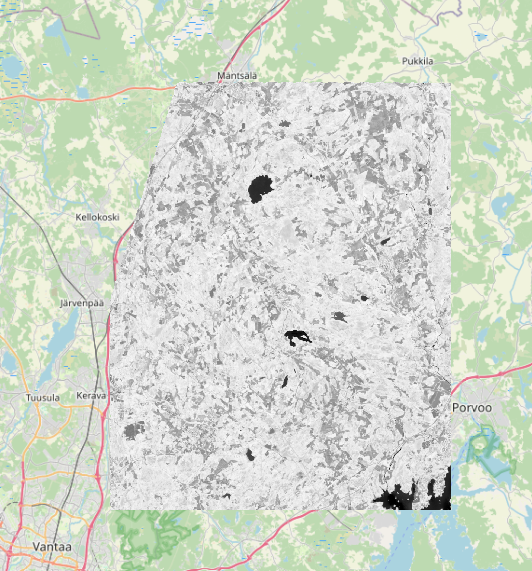
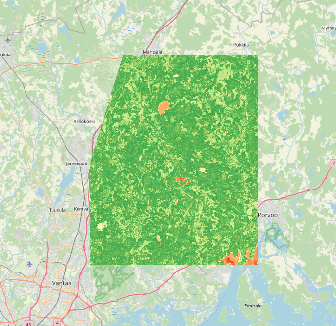

# NDVI ETL Pipeline

A fully containerized geospatial data engineering pipeline for processing NDVI from Landsat imagery using user-defined Areas of Interest (AOIs).

This project demonstrates how to build, deploy, and monitor a complete ETL process for remote sensing data. It supports querying STAC APIs, downloading Landsat data, computing NDVI, clipping rasters to AOIs, and storing metadata in PostGIS.

> **Status**: Production-ready, tested, Dockerized, and CI-integrated

---

## Project Overview

### Key Features

-  **STAC query**: Accesses Microsoft's Planetary Computer STAC API for Landsat Collection 2 Level-2 data
-  **Band downloads**: Downloads Red (B4) and NIR (B5) bands as GeoTIFFs
-  **NDVI computation**: Calculates NDVI from scaled reflectance values
-  **Clipping**: Clips rasters to your AOI polygon using GDAL/Rasterio
-  **Output**: Saves full and clipped NDVI rasters to `/data/processed`
-  **AOI storage**: Initializes and writes AOIs to a PostGIS database
-  **Logging**: Logs every step with timestamps, file paths, and metrics
-  **Tests**: Includes unit tests for NDVI logic (with mocked inputs)
-  **Dockerized**: Runs in Docker with reproducible Micromamba env
-  **CI/CD**: Runs `pytest` via GitHub Actions on every push

---

## Architecture
```text
+---------------------+
|   User-defined AOI  |
|  (eg. [25.13, 60.32,|
|   25.63, 60.63])    |
+---------------------+
            |
            v
+------------------------+
|   STAC API Query       |
|  (Landsat C2 Level-2)  |
+------------------------+
            |
            v
+------------------------+
|  Download B4 & B5 Bands|
|   (Red + NIR, GeoTIFF) |
+------------------------+
            |
            v
+------------------------+
|     Compute NDVI       |
|    (scaled reflectance)|
+------------------------+
            |
            v
+------------------------+
|     Clip to AOI        |
|   (Raster math + mask) |
+------------------------+
            |
            v
+------------------------+        +-----------------+
|  Save processed raster | -----> |   PostGIS (AOI) |
|   (/data/processed)    |        +-----------------+
+------------------------+
```

---

## Output Example

### NDVI original output in QGIS



### NDVI polished (Singleband PseudoColor with RdYlGn color ramp) output in QGIS


> NDVI raster clipped to AOI and visualized in QGIS. Output stored in `/data/processed`.

---

## Project Structure

```text
ndvi-etl-pipeline/
│
├── src/                      
│   ├── extract/              
│   ├── transform/            
│   ├── load/                 
│   └── main.py               
│
├── data/                     
│   ├── aoi/                  
│   ├── raw_landsat/          
│   ├── processed/            
│
├── logs/                     
│   └── app.log
│
├── docker-compose.yml        
├── Dockerfile                
├── environment.yml           
├── pyproject.toml            
├── requirements.txt          
├── README.md                 
├── tests/                    
│   ├── test_ndvi.py
│   └── test_download.py
```

---

# Quickstart

## 1. Clone the repo

```bash
git clone https://github.com/KofiAdu/ndvi-etl-pipeline.git
cd ndvi-etl-pipeline
```

## 2. Define your AOI

The pipeline expects the AOI to be configured using a **bounding box** in `config/settings.yaml`:

```yaml
aoi:
  bbox: [25.13, 60.32, 25.63, 60.63]  # [minx, miny, maxx, maxy]
  geojson_path: "data/aoi/boundary.geojson"  
  bbox_pad_km: 0
```

## 3. Run the pipeline

### Local Setup
###Create and activate a virtual environment
```bash
python -m venv .venv
source .venv/bin/activate (macOS/Linux)
.venv\Scripts\activate   (Windows)

# Install dependencies
pip install --upgrade pip
pip install -r requirements.txt

# Run the pipeline
python main.py
```
### Or using conda / micromamba:
```bash
# Create env from environment.yml
micromamba create -f environment.yml
micromamba activate ndvi

# Run the pipeline
python main.py
```

### Docker
```bash
# Run in docker
docker compose up --build
```
> This builds the app and database, initializes PostGIS tables, loads the AOI, queries Landsat scenes, downloads B4/B5 bands, computes NDVI, and writes output.

---

## Testing

### Unit tests
```bash
pytest
```

### CI (GitHub Actions)

- Tests run automatically on every push
- Can be extended to run in Docker or check logs

---

## Configuration

### STAC query settings

Update `config/settings.yaml`:
```yaml
start_date: "2022-06-01"
end_date: "2022-12-31"
cloud_cover: 10
max_items: 10
```

### AOI path
Configured in `main.py`:
```python
AOI_PATH = Path("data/aoi/boundary.geojson")
```

---

## Environment

- Python 3.9
- GDAL / Rasterio / Geopandas
- PostGIS 15
- Docker & Compose
- Micromamba-based image for fast builds

---

## Future Improvements

- [ ] Streamlit or Leaflet viewer for NDVI rasters
- [ ] Airflow-based scheduler for monthly updates
- [ ] Cloud storage upload (S3 or GCS)
- [ ] AOI database interface (e.g., list + status + last run)

---

## License

MIT License (see `LICENSE`)


